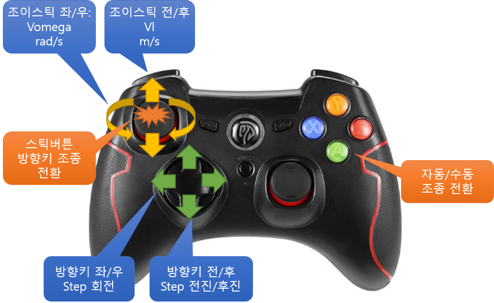

# OMOROS

오모로봇 제품군의 ROS 지원 드라이버입니다.
이 드라이버를 사용하여 자율주행, 원격 주행에 필요한 엔코더, Odometry정보를 가져오고 주행 명령을 내릴 수 있습니다.
지원 모델: 

[R1](https://www.omorobot.com/omo-r1)

[R1-mini](https://www.omorobot.com/omo-r1-mini)

## 1. 설치방법

### 1.1 ROS-Kinetic on Ubuntu 16.04 PC

ROS패키지들이 설치되어있는 ros_catkin_ws/src 에서 git clone하여 소스를 복사하면 됩니다.

```
$ cd to catkin_ws/src
$ git clone https://github.com/omorobot/omoros.git
$ cd to catkin_ws
$ catkin_make
```
### 1.2 ROS-Kinetic on Raspbian 

로봇을 라즈베리파이에 연결하여 구동하는 경우 아래 설치 과정을 따라 설치 후 진행하시기 바랍니다.
tf2 등의 라이브러리가 필요하므로 Desktop 버전으로 설치하는 것을 권장합니다.

[Installing ROS Kinetic on the Raspberry Pi](http://wiki.ros.org/ROSberryPi/Installing%20ROS%20Kinetic%20on%20the%20Raspberry%20Pi)

** 이미지 파일로부터 Raspberry Pi 3 적용**

위 설치과정이 번거롭다면 Raspberry Pi 3를 위해 만들어진 전체 이미지를 다운로드 하고 etcher와 같은 이미지 쓰기 도구로 microSD에 구워서 사용하여 설치합니다.

[Raspian stretch image with ROS-kinetic installed](https://drive.google.com/open?id=1jAGlkIUAB_SLq0WCe1G4SktzwUm7abHW)

처음 microSD로 부팅한 후에는 터미널에서 raspi-config 를 실행하여 파일시스템을 SD카드 전체로 확장합니다.

<div align="center">

</div>

### 1.3 Dependency

드라이버를 구동하기 위해서는 기본적으로 다음과 같은 패키지들이 필요합니다.

자세한 설치 방법은 아래 링크를 참조하세요.

* joy node 를 설치하기 위해 다음과 같은 패키지들이 필요합니다.

```
$ sudo apt install libusb-dev libbluetooth-dev libcwiid-dev libspnav-dev
```

Joy: [ROS JOY](http://wiki.ros.org/joy)

tf: [ROS TF](http://wiki.ros.org/tf)

### 1.4 Serial Port 설정

USB to Serial 포트를 연결하고 시리얼포트의 경로를 확인합니다. 보통 /dev/ttyUSB# 등으로 설정되어있습니다.

기존에 다른 시리얼포트가 연결되어있는 경우 연결 순서에 따라 경로가 바뀔 수 있으므로 /etc/udev/rules.d 에서 경로를 지정할 필요가 있습니다.

또는 bringup 폴더에 있는 create_udev_rules 스크립트를 실행하여 규칙을 추가하면 항상 /dev/ttyMotor 라는 경로로 고정됩니다.


## 2. How to use

### 2.1 Launching omoros_core

launch 폴더에는 omoros 실행을 위한 launch 파일들이 존재합니다.

조이스틱을 통한 원격 조작을 시험하기 위해서는 omoros_core.launch 파일만 실행하면 됩니다.

먼저 omoros_core.launch 파일을 열어 다음 항목을 찾아봅니다.

```
<node pkg="omoros" type="driver_r1.py" name="omoros" output="screen">
   <param name="port" value="/dev/ttyMotor"/>
   <param name="baud" value="115200"/>
   <param name="modelName" value="r1"/>
</node>
```
R1 및 R1-mini 버전에 따라 modelName을 r1 혹은 mini로 지정합니다. 

**주의** 실행 전에 PC의 Serial port와 로봇의 연결상태를 확인하세요.

시리얼 포트 관련 문제는 [다음](#serial)을 참조 바랍니다.

이제 콘솔 창에 다음과 같이 입력하여 실행합니다.
```
$ roslaunch omoros omoros_core.launch
```

### 2.2 조작 방법

로봇의 조작 방법은 아래 그림을 참조하시기 바랍니다.

<div align="center">
  
</div>

 - 기본적인 조작 방법은 스틱을 앞/뒤, 좌/우로 조작하여 움직이는 것입니다.
 - 스틱의 버튼을 누르면 방향키 모드로 전환하여 일정 거리, 각도만큼 움직입니다.
 - 버튼의 A키 혹은 1번 키를 누르면 조이스틱 조종을 해제하고 cmd_vel 메세지의 속도/회전속도 명령으로 동작합니다.
 
조이스틱 조작에서 에러가 발생하는 경우 [다음](#joystick)을 참조 바랍니다.

### 2.3 Messages
이 드라이버는 다음과 같은 메세지들을 Publish 혹은 Subscribe 합니다.
```
$ rostopic list

/cmd_vel
/diagnostics
/joy
/joy/set_feedback
/motor/encoder/left
/motor/encoder/right
/motor/status
/odom
```
R1Command 메세지는 삭제되고 cmd_vel 명령으로 대체되었습니다.

**Subscribed message**

* joy 
  - Axis: Joystick의 스틱 입력을 받아 좌/우 바퀴의 회전 속도를 제어합니다.
  - BUttons: 1번 버튼(A) 입력으로 조이스틱 조종 및 자동주행을 선택합니다.


* cmd_vel
  - http://wiki.ros.org/Robots/TIAGo/Tutorials/motions/cmd_vel
  - cmd.linear.x : 로봇의 종방향 속도 m/s
  - cmd.angular.z : 로봇의 회전 속도 rad/s

**Publish message**

* motor/encoder/left or right: 모터 엔코더의 누적된 카운트를 출력합니다.

* motor/status 
   - 좌/우 모터의 엔코더, RPM, ODO, speed(mm/s)값을 전송합니다.
<div align="center">
  
</div>

* odom: Navigation에 필요한 속도/회전속도, 위치를 전송합니다.
 - "odom" 의 하위 링크는 "base_link" 입니다.
<div align="center">
  
</div>

## 3. Trouble shooting

### 3.1 <a name="serial"> Serial Port Error </a>
* 퍼미션 오류: Add user dialout

아래와 같은 메세지가 뜨면서 시리얼 포트를 열 수 없는 경우

[Errno 13] Permission denied: '/dev/ttyUSB0'
사용자 그룹에 dialout을 추가합니다.

'''
$ sudo gpasswd -a UserName dialout
'''

로그아웃 후 재 로그인을 하면 정상적으로 실행됩니다.

* 시리얼 포트를 열 수 없는 경우

시리얼 포트의 경로를 확인합니다.

launch/omoros_core.launch를 열고 다음 코드의 내용을 수정합니다.

```
      <param name="port" value="/dev/ttyMotor"/>
```

Raspberry PI의 내장 시리얼포트를 사용하기 위해서는 경로를 아래와같이 설정합니다.

'/dev/ttyS0'

### 3.2 <a name="joystick"> Joystick index Error </a>

조이스틱의 특정 버튼을 눌렀을때 에러가 발생할 수 있습니다.
이것은 조이스틱에 따라 axes와 buttons에 할당된 index 번호가 다르기 때문입니다.

rostopic echo joy 명령으로 조이스틱에 할당된 axes와 buttons의 index 위치가 바뀌었다면
callbackJoy 함수에서 해당 번호를 수정해야합니다. self.joyAxes[#] 혹은 self.joyButtons[#] 부분
```
---
header: 
  seq: 14
  stamp: 
    secs: 1559113339
    nsecs: 939150960
  frame_id: ''
axes: [0.0, 0.0, 0.0, 0.0, 0.0, 0.0]
buttons: [0, 1, 0, 0, 0, 0, 0, 0, 0, 0, 0, 0, 0]
---
```

Copyright (c) 2019, OMOROBOT Inc.,

